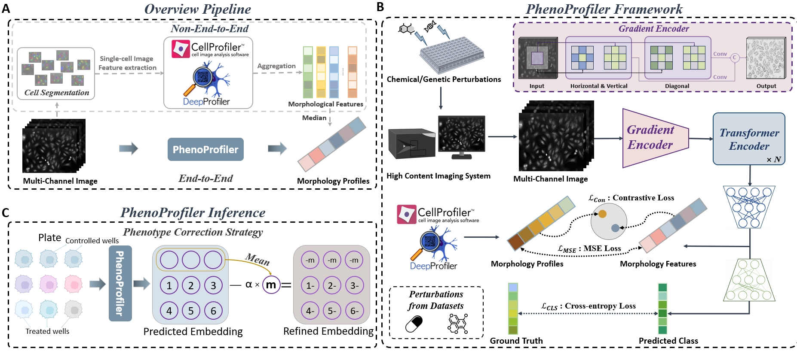
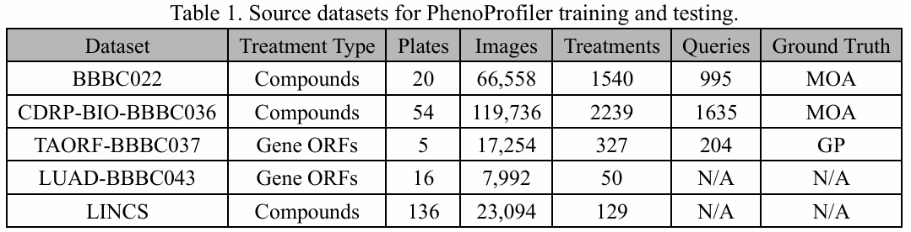

# PhenoProfiler : Advancing Morphology Representations for Image-based Drug Discovery

**PhenoProfiler** is an advanced tool for phenotypic profiling of cell morphology, to efficiently extract phenotypic effects of perturbations from high-throughput imaging. 

**PhenoProfiler** operates as an end-to-end image encoder, converting multi-channel images directly into low-dimensional quantitative features, thus eliminating the need for extensive preprocessing in non-end-to-end pipeline. For more details, please refer to our [paper]().

<p align="center">
    
</p>


---

## To be updated:
- Code for all `Figures` in our paper.
- The `PhenoProfiler` package, which can be installed via `pip install PhenoProfiler`.

---


## Requirements

```
git clone https://github.com/QSong-github/PhenoProfiler.git
cd PhenoProfiler
conda env create -f environment.yaml
conda activate PhenoProfiler
```

## Usage
See [PhenoProfiler_inference.ipynb](PhenoProfiler_inference.ipynb). 

The trained models of PhenoProfiler can be downloaded at [synapse](https://www.synapse.org/Synapse:syn64371555) or [google drive](https://drive.google.com/drive/folders/1Z58cPewzSNLNKJii2OEip6IopouL_Rdd).

```
import numpy as np
import torch
from skimage.transform import resize
from PIL import Image
from models import PhenoProfiler

# List of image paths
img_paths = [
    './Sample_imgs/IXMtest_A01_s2_w1AA6B1894-F561-42EE-9D1D-E21E5C741B75.png',
    './Sample_imgs/IXMtest_A01_s2_w3A597237B-C3D7-43AE-8399-83E76DA1532D.png',
    './Sample_imgs/IXMtest_A01_s2_w50F1562CD-EBCF-408E-9D8D-F6F0FDD746C8.png',
    './Sample_imgs/IXMtest_A01_s2_w246FFAEE1-BEB6-4C81-913B-B979EC0C4BC3.png',
    './Sample_imgs/IXMtest_A01_s2_w46657239A-5AFE-4C29-BB9B-49978EFE4791.png',
]

# Load and preprocess images
images = np.stack([resize(np.array(Image.open(path)), (448, 448), anti_aliasing=True) for path in img_paths])
images_tensor = torch.tensor(images).float().cuda()

# Load model
model = PhenoProfiler().cuda()
model.load_state_dict(torch.load('./PhenoProfiler.pt', weights_only=True))

# Generate embeddings
image_features = model.image_encoder(images_tensor.unsqueeze(0))
image_embeddings = model.image_projection(image_features)

# Print the shape of the embeddings
print(image_embeddings.shape)
```


# Training Model

## Data Preparation

<p align="center">
    
</p>

```
BBBC022: aws s3 cp s3://cytodata/datasets/Bioactives-BBBC022-Gustafsdottir/ ./ --recursive --no-sign-request
CDRP-BIO-BBBC036: aws s3 cp s3://cytodata/datasets/CDRPBIO-BBBC036-Bray/ ./ --recursive --no-sign-request
TAORF-BBBC037: aws s3 cp s3://cytodata/datasets/TA-ORF-BBBC037-Rohban/ ./ --recursive --no-sign-request
cpg0019: aws s3 cp s3://cellpainting-gallery/cpg0019-moshkov-deepprofiler/ ./ --recursive --no-sign-request
```

After download, organise the dataset as follows:
```
dataset/
    bbbc022/
        images/
            20585/
                IXMtest_B15_s8_w49DE56250-C587-48D8-8840-5A322A3F0177.png
                IXMtest_F20_s4_w4ABAD0B1C-D157-496F-96B9-5909F00DEFF7.png
                ...
        embedding/ # from cpg0019
            20585/
                A01/
                    1/
                        embedding.npz
        profiling.csv
    bbbc036/
        images/ ...
        embedding/ ...
        profiling.csv
    bbbc037/
        images/ ...
        embedding/ ...
        profiling.csv
```

## Training from scratch
**Step1**: training the first model by regression loss:
```
python train.py --model MSE
```

**Step2**: training the final model by all loss:
```
python train.py --exp_name result/PhenoProfiler --pretrained_model result/PhenoProfiler_MSE
```

## Testing

The phenotype correction strategy-processed features are available by executing the corresponding ipynb file [Phenotype correction strategy.ipynb](Phenotype_correction_strategy.ipynb). 

```
python test_22.py
python test_36.py
python test_37.py
```


# Reference
If you find this project is useful for your research, please cite:
```
@article{PhenoProfiler,

}
```

Our code is based on the [CLIP](https://github.com/openai/CLIP) and [BLEEP](https://github.com/bowang-lab/BLEEP). Special thanks to the authors and contributors for their invaluable work.

